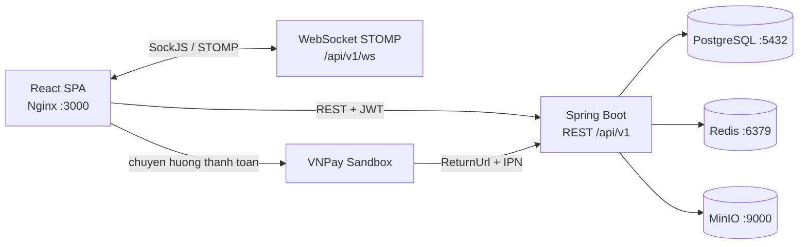
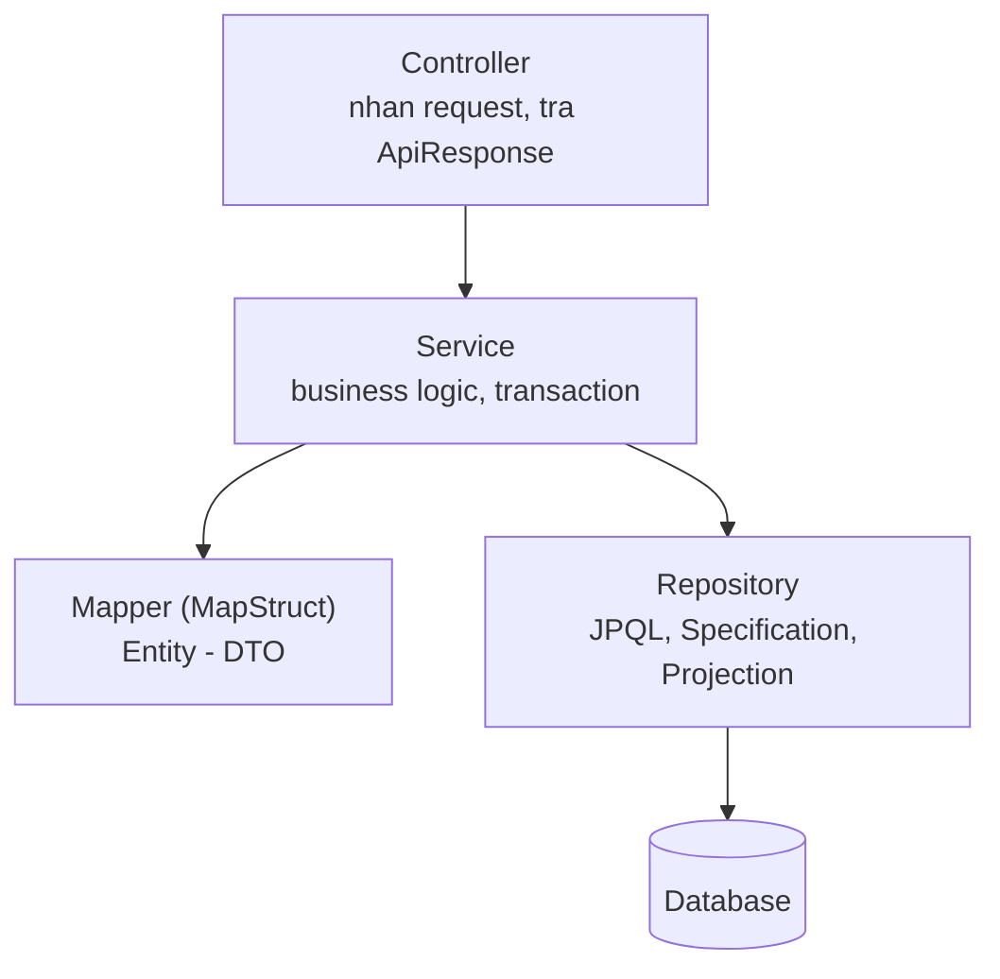
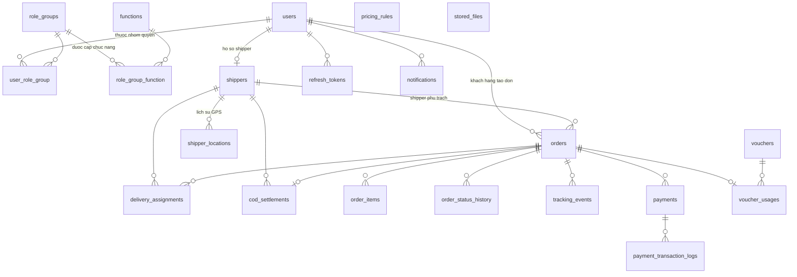
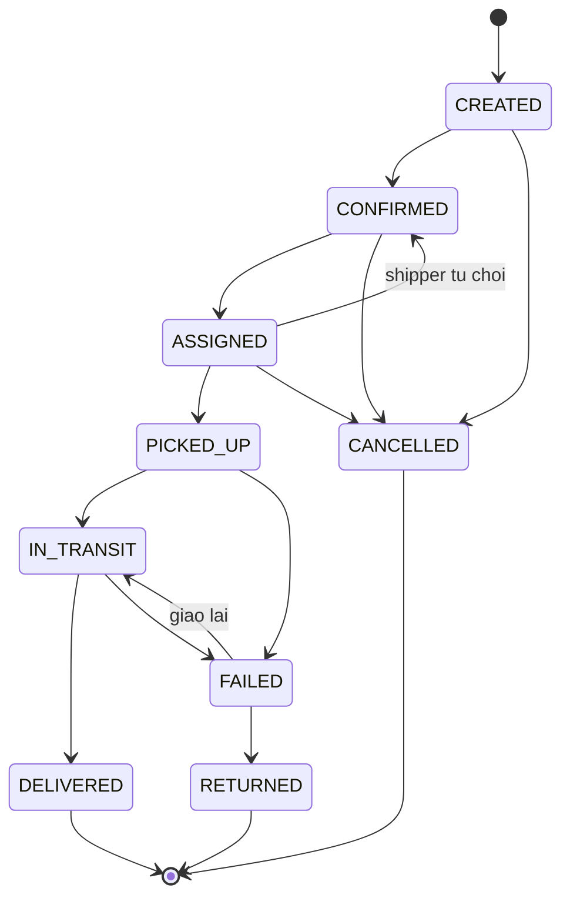
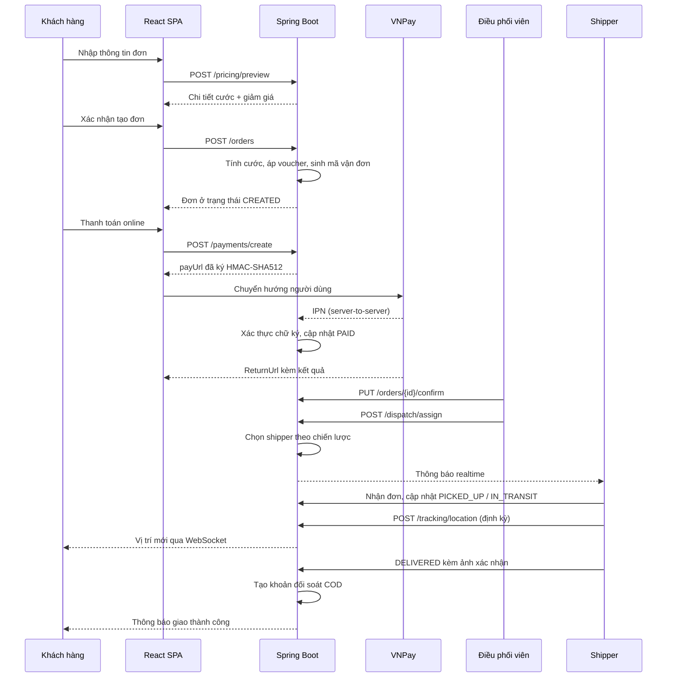

# Tài liệu thiết kế kỹ thuật

## 1. Phạm vi và mục tiêu

Hệ thống quản lý toàn bộ vòng đời một đơn giao hàng: khách hàng tạo đơn và thanh toán, điều phối viên phân công shipper, shipper giao hàng và cập nhật hành trình, kế toán đối soát tiền thu hộ, quản trị viên theo dõi số liệu vận hành.

Bốn vai trò sử dụng hệ thống:

| Vai trò | Nhiệm vụ chính |
| --- | --- |
| `ADMIN` | Quản trị người dùng, nhóm quyền, shipper, bảng phí, voucher, xem toàn bộ số liệu |
| `DISPATCHER` | Xác nhận đơn, phân công shipper, theo dõi đơn đang giao, đối soát COD |
| `SHIPPER` | Nhận/từ chối đơn, cập nhật trạng thái, đẩy GPS, nộp tiền COD |
| `CUSTOMER` | Tạo đơn, thanh toán, theo dõi hành trình đơn của mình |

## 2. Kiến trúc tổng thể



Backend theo kiến trúc ba lớp, mỗi lớp có trách nhiệm rõ ràng:



Quy tắc bắt buộc: controller không chứa business logic và không tự mapping; repository chỉ truy cập dữ liệu; toàn bộ chuyển đổi Entity/DTO nằm trong package `mapper`.

## 3. Thiết kế cơ sở dữ liệu

Mọi bảng đều có nhóm cột audit dùng chung từ `BaseEntity`: `id`, `created_date`, `created_by`, `updated_date`, `updated_by`, `is_deleted`. Người tạo và người sửa được ghi tự động qua `AuditorAware`, xóa dữ liệu là xóa mềm (`is_deleted = true`).

### 3.1 Sơ đồ quan hệ



### 3.2 Các bảng chính

| Bảng | Vai trò | Điểm đáng lưu ý |
| --- | --- | --- |
| `users` | Tài khoản đăng nhập | Mật khẩu băm BCrypt, `username` unique |
| `role_groups`, `functions` | Nhóm quyền và chức năng | Phân quyền theo `function_code`, không hard-code vai trò trong code |
| `user_role_group`, `role_group_function` | Bảng nối nhiều-nhiều | Khóa chính tổ hợp |
| `shippers` | Hồ sơ shipper | `current_load` và `max_concurrent_orders` dùng để chặn quá tải |
| `shipper_locations` | Lịch sử GPS | Index `(shipper_id, recorded_at)` để vẽ lại hành trình |
| `orders` | Đơn hàng | Index theo `status`, `customer_id`, `current_shipper_id`, `created_date` |
| `order_status_history` | Nhật ký chuyển trạng thái | Phục vụ truy vết và kiểm toán |
| `delivery_assignments` | Phân công | Lưu cả kiểu gán (thủ công/tự động) và khoảng cách lúc gán |
| `tracking_events` | Sự kiện hành trình | Nguồn dữ liệu cho timeline phía khách hàng |
| `pricing_rules` | Bảng phí theo dịch vụ | `service_type` unique, cache Redis 30 phút |
| `vouchers` | Mã giảm giá | Cột `version` cho khóa lạc quan chống trừ trùng lượt |
| `voucher_usages` | Lượt đã dùng | Chặn vượt `usage_limit_per_user` |
| `payments`, `payment_transaction_logs` | Giao dịch và log thô | `txn_ref` unique, log giữ nguyên bản để đối soát |
| `cod_settlements` | Tiền thu hộ | `order_id` unique, mỗi đơn chỉ đối soát một lần |
| `notifications` | Thông báo trong ứng dụng | Index `(user_id, is_read)` |
| `stored_files` | Metadata file MinIO | Nội dung file không bao giờ lưu trong database |

Toàn bộ schema và dữ liệu mẫu được quản lý bằng Liquibase (34 changeset trong `backend/src/main/resources/db/changelog/`). Hibernate chạy ở chế độ `ddl-auto: validate` nên nếu entity lệch với schema, ứng dụng sẽ dừng ngay khi khởi động thay vì âm thầm chạy sai.

## 4. State machine đơn hàng



Bảng chuyển tiếp hợp lệ khai báo ngay trong enum `OrderStatus`, nên mọi nơi trong hệ thống dùng chung một nguồn sự thật:

```13:54:backend/src/main/java/com/viettel/delivery/constant/enums/OrderStatus.java
public enum OrderStatus implements BaseEnum {

    CREATED("Chờ xác nhận"),
    // ... các trạng thái khác ...

    private static final Map<OrderStatus, Set<OrderStatus>> TRANSITIONS = new EnumMap<>(OrderStatus.class);

    static {
        TRANSITIONS.put(CREATED, EnumSet.of(CONFIRMED, CANCELLED));
        // ... các chuyển tiếp khác ...
    }
```

`OrderStatusService` là nơi duy nhất được đổi trạng thái đơn. Mỗi lần đổi, service sẽ: kiểm tra chuyển tiếp hợp lệ, kiểm tra dữ liệu bắt buộc (ví dụ ảnh xác nhận khi hoàn tất), cập nhật các mốc thời gian và bộ đếm của shipper, ghi lịch sử, rồi phát sự kiện.

## 5. Luồng nghiệp vụ chính



## 6. Phân quyền

Hệ thống dùng hai lớp phân quyền độc lập.

**Phân quyền chức năng** dựa trên `function_code` lưu trong bảng `functions`. Khi đăng nhập, backend nạp toàn bộ chức năng của các nhóm quyền mà người dùng thuộc về và đưa vào JWT. Mỗi API được bảo vệ bằng `@PreAuthorize`:

```45:49:backend/src/main/java/com/viettel/delivery/controller/OrderController.java
    @PostMapping("/search")
    @PreAuthorize(PermissionCode.HAS_ORDER_VIEW)
    @Operation(summary = "Tim kiem don hang",
            description = "Ket qua tu dong gioi han theo quyen: khach hang chi thay don cua minh, "
                    + "shipper chi thay don duoc phan cong")
```

Frontend dùng cùng danh sách đó để render menu và chặn route, nên giao diện không bao giờ hiển thị chức năng mà tài khoản không có quyền. Đây chỉ là lớp trải nghiệm — quyết định cuối cùng vẫn ở backend.

**Phân quyền dữ liệu** được áp ở tầng truy vấn chứ không lọc ở frontend. `OrderSpecification` nhận thêm hai tham số giới hạn và tự thêm điều kiện vào câu query:

```23:35:backend/src/main/java/com/viettel/delivery/repository/specification/OrderSpecification.java
    public static Specification<Order> build(OrderSearchRequest request,
                                             Long restrictCustomerId,
                                             Long restrictShipperId) {
        return (root, query, criteriaBuilder) -> {
            List<Predicate> predicates = new ArrayList<>();
            predicates.add(criteriaBuilder.isFalse(root.get("isDeleted")));

            // Phan quyen du lieu: khach hang chi thay don minh tao, shipper chi thay don duoc giao
            if (restrictCustomerId != null) {
                predicates.add(criteriaBuilder.equal(root.get("customer").get("id"), restrictCustomerId));
            }
```

Bảng phân quyền đầy đủ:

| Chức năng | ADMIN | DISPATCHER | SHIPPER | CUSTOMER |
| --- | --- | --- | --- | --- |
| Quản lý người dùng, nhóm quyền | Có | Chỉ xem người dùng | Không | Không |
| Quản lý shipper | Toàn quyền | Xem và sửa | Chỉ hồ sơ của mình | Không |
| Tạo đơn hàng | Có | Có | Không | Có |
| Xác nhận, phân công đơn | Có | Có | Không | Không |
| Nhận/từ chối đơn, đẩy GPS | Không | Không | Có | Không |
| Import / export Excel | Có | Có | Không | Không |
| Cấu hình bảng phí, voucher | Có | Chỉ xem | Không | Chỉ xem |
| Thanh toán online | Có | Chỉ xem | Không | Có |
| Đối soát COD | Xác nhận | Xác nhận | Nộp tiền | Không |
| Dashboard toàn hệ thống | Có | Chỉ KPI | Số liệu của mình | Số liệu của mình |

## 7. Các điểm thiết kế đáng chú ý

### 7.1 Tính cước bằng Strategy pattern

Mỗi loại dịch vụ là một implementation của `ShippingFeeStrategy`, phần công thức chung nằm ở lớp trừu tượng, phần khác biệt nằm ở method `calculateSurcharge`:

- `STANDARD` — chỉ công thức cơ bản.
- `EXPRESS` — cộng thêm 15% phần phí quãng đường (phí ưu tiên tuyến riêng) và phụ phí vùng xa.
- `SAME_DAY` — đơn đặt sau 15h cộng 20% phụ phí giờ cao điểm vì quỹ thời gian còn lại quá ngắn.

Thêm loại dịch vụ mới chỉ cần thêm một class, không sửa code cũ. `ShippingFeeCalculator` nhận vào `List<ShippingFeeStrategy>` và tự lập bảng tra theo `ServiceType`.

Công thức cơ bản:

```
cước = phí cơ bản
     + (quãng đường vượt mức cơ bản × phí mỗi km)
     + (khối lượng vượt mức cơ bản, làm tròn lên × phí mỗi kg)
     + phụ phí (vùng xa, hàng dễ vỡ, phụ phí riêng của dịch vụ)
     + tiền thu hộ × tỉ lệ phí COD
nếu cước < phí tối thiểu thì lấy phí tối thiểu
```

Toàn bộ tính toán dùng `BigDecimal`, không dùng `double` cho tiền.

### 7.2 Phân công shipper tự động

Ba chiến lược cùng implement `ShipperAssignmentStrategy`, chọn qua biến môi trường `DISPATCH_STRATEGY`:

| Chiến lược | Cách chọn |
| --- | --- |
| `NEAREST` | Khoảng cách Haversine từ shipper tới điểm lấy hàng nhỏ nhất, trong bán kính `DISPATCH_MAX_RADIUS_KM`. Nếu đơn không có toạ độ thì tự chuyển sang chọn theo tải ít nhất |
| `LEAST_LOAD` | Ít đơn đang giữ nhất, bằng nhau thì ưu tiên đánh giá cao hơn |
| `ROUND_ROBIN` | Luân phiên theo thứ tự để mọi shipper đều có cơ hội |

Trước khi gán, hệ thống kiểm tra shipper còn đúng trạng thái nhận đơn và chưa vượt `max_concurrent_orders`. Khi shipper từ chối, đơn tự động quay về `CONFIRMED` và bộ đếm tải được trả lại.

### 7.3 Thanh toán VNPay

Tuân thủ API version 2.1.0: tham số sắp xếp theo alphabet, nối thành chuỗi canonical, ký HMAC-SHA512 bằng `vnp_HashSecret`, số tiền nhân 100 và không có phần thập phân.

Hai đường nhận kết quả được xử lý khác nhau vì mục đích khác nhau:

- **ReturnUrl** — người dùng được chuyển về frontend. Chỉ dùng để hiển thị kết quả, vẫn xác thực chữ ký trước khi tin.
- **IPN** — VNPay gọi server-to-server, đây mới là nguồn tin cậy để chốt giao dịch. Endpoint này bất biến (idempotent): gọi lại nhiều lần không làm đổi kết quả, và trả về đúng bộ mã `RspCode` mà VNPay quy định.

`PaymentGateway` là interface, nên thêm MoMo hay ZaloPay chỉ cần thêm một implementation. Khi chưa cấu hình `VNPAY_TMN_CODE`, hệ thống tự chuyển sang cổng giả lập để quy trình demo vẫn chạy trọn vẹn.

### 7.4 Tracking realtime

Shipper gửi toạ độ lên `POST /tracking/location`. Backend lưu vào `shipper_locations`, cập nhật vị trí hiện tại của shipper, rồi broadcast qua hai kênh STOMP: `/topic/orders/{orderCode}` cho khách hàng đang xem đơn đó, và `/topic/shippers/location` cho màn hình điều phối.

Vì handshake SockJS không cho phép đặt header `Authorization`, token được truyền qua query param `access_token` và `JwtAuthenticationFilter` đọc cả hai nguồn.

Lỗi khi đẩy WebSocket luôn được bắt và chỉ ghi log — dữ liệu đã nằm trong database nên nghiệp vụ không bị ảnh hưởng nếu kênh realtime tạm thời gián đoạn.

### 7.5 Xử lý bất đồng bộ bằng sự kiện

Khi trạng thái đơn thay đổi, `OrderStatusService` phát `OrderStatusChangedEvent`. Có hai listener với hai cơ chế khác nhau, tương ứng với hai mức độ quan trọng:

- `OrderTrackingListener` chạy đồng bộ trong cùng transaction — ghi sự kiện tracking và tạo khoản đối soát COD. Đây là dữ liệu nghiệp vụ nên phải nhất quán tuyệt đối với trạng thái đơn.
- `NotificationEventListener` chạy `@Async` sau khi transaction commit — gửi thông báo. Nếu gửi thất bại thì nghiệp vụ chính vẫn an toàn.

Các job định kỳ: quét đơn quá hạn giao mỗi 30 phút và dọn refresh token hết hạn lúc 3h sáng.

### 7.6 Chống dùng voucher vượt giới hạn

`VoucherService.evaluate` chỉ kiểm tra và trả về kết quả kèm lý do, không ném exception — nhờ vậy màn hình tính cước vẫn hiển thị được phí dù voucher không hợp lệ. Việc trừ lượt nằm ở `consume`, chạy trong transaction tạo đơn, nạp lại voucher để cột `@Version` phát huy tác dụng khóa lạc quan. Hai giao dịch cùng tranh lượt cuối cùng thì một giao dịch sẽ thất bại thay vì cả hai đều thành công.

Khi đơn bị hủy, `release` hoàn lại lượt đã dùng.

## 8. Chuẩn code áp dụng xuyên suốt

| Quy định | Cách thực hiện |
| --- | --- |
| Response thống nhất | `ApiResponse<T>` gồm `code`, `message`, `data`; controller luôn trả `ResponseEntity` |
| Xử lý lỗi tập trung | `GlobalExceptionHandler` với `@RestControllerAdvice`, không try-catch rải rác |
| Mã lỗi chuẩn hóa + i18n | `ErrorCode` là key trong `messages_vi` / `messages_en`, chọn theo header `Accept-Language` |
| API có version | Context path `/api/v1` |
| Cấu hình tách biệt | Toàn bộ đọc từ biến môi trường, `.env` không commit, `.env.example` làm mẫu |
| Enum thay magic string | 17 enum nghiệp vụ, mỗi giá trị kèm mô tả tiếng Việt trả về cho frontend |
| BaseEntity + audit | Kế thừa `BaseEntity`, `AuditorAware` ghi người tạo/sửa tự động |
| Liquibase | Mọi thay đổi schema qua changeset, `ddl-auto: validate` |
| MapStruct | Mapping tập trung trong package `mapper`, tách Request DTO và Response DTO |
| Search bằng object | Mỗi màn hình có `XxxSearchRequest` kế thừa `BaseSearchRequest`, gọi qua `POST /search` |
| Dynamic query | JPA Specification trong `repository/specification`, không sinh hàng loạt method `findByAAndB...` |
| Chỉ select trường cần | Dashboard dùng DTO projection `select new`; danh sách dùng `@EntityGraph` để tránh N+1 |
| Không trả entity ra API | Luôn qua DTO |
| Constructor injection | Dùng `@RequiredArgsConstructor`, không field injection |
| Upload qua MinIO | File lên `temp/` trước, sau khi nghiệp vụ xác nhận mới chuyển sang `<feature>/yyyy/MM/`; database chỉ giữ metadata |
| Logging | Logback ra console và file rolling, tách riêng `error.log` |
| Swagger | `@Tag` và `@Operation` đầy đủ, 67 endpoint được mô tả |

## 9. Kiểm thử

55 unit test bằng JUnit 5, Mockito và AssertJ, tập trung vào phần logic dễ sai nhất:

| Test | Phạm vi |
| --- | --- |
| `ShippingFeeStrategyTest` | 10 test: công thức từng dịch vụ, làm tròn khối lượng, phí tối thiểu, phụ phí giờ cao điểm |
| `VoucherServiceImplTest` | 13 test: ba hình thức giảm giá, giới hạn mức giảm, toàn bộ nhánh từ chối |
| `OrderStatusTest` | 9 test: chuyển tiếp hợp lệ và bất hợp lệ của state machine |
| `ShipperAssignmentStrategyTest` | 8 test: ba chiến lược phân công, bán kính, trường hợp thiếu toạ độ |
| `VnPayUtilTest` | 9 test: thứ tự tham số, mã hóa URL, ký và xác thực chữ ký, phát hiện dữ liệu bị sửa |
| `GeoUtilTest` | 6 test: Haversine, thiếu toạ độ, hệ số đường bộ |

Ngoài ra `scripts/smoke-test.sh` chạy 21 bước kiểm thử toàn bộ quy trình qua REST API thật, và `scripts/ws-check.mjs` xác nhận luồng realtime WebSocket hoạt động.
